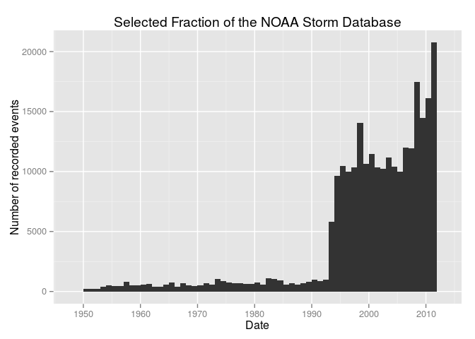
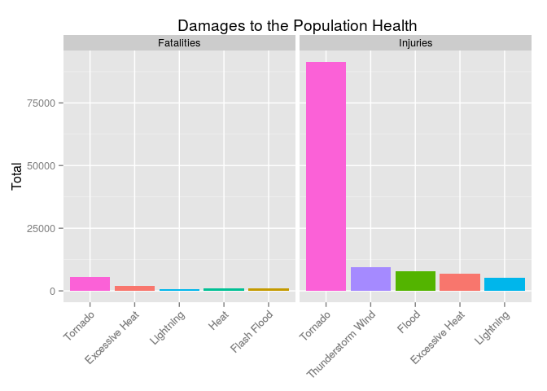
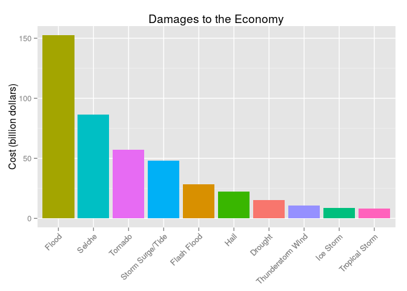

# Damages Caused by Severe Weather Events in the United States

Severe weather events can cause both public health and economic problems.
This explores the U.S. National Oceanic and Atmospheric Administration's (NOAA) 
storm database with the goal of answering the following two questions:

1.  Which types of events are most harmful with respect to population health?
2.  Which types of events have the greatest economic consequences?

## Data Processing

The analysis was performed using R version 3.1.2 (2014-10-31) together with 
a group of supporting packages available in
[The Comprehensive R Archive Network](http://cran.r-project.org/) (CRAN).
The first step in the analysis is to load all the required packages in R:


```r
packages <- c("dplyr", "lubridate", "stringi", "stringdist", "ggplot2", "tidyr")
for (package in packages) {
    library(package, character.only = TRUE, warn.conflicts = FALSE)
}
```

The data used in the analysis is contained in a bzip2-compressed file 
containing a comma-separated-value (CSV) file, which can be downloaded 
from the following link:

https://d396qusza40orc.cloudfront.net/repdata%2Fdata%2FStormData.csv.bz2

Additional information about some of the variables provided in the 
[Storm Data Preparation](https://d396qusza40orc.cloudfront.net/repdata%2Fpeer2_doc%2Fpd01016005curr.pdf)
and the [Storm Data FAQ](https://d396qusza40orc.cloudfront.net/repdata%2Fpeer2_doc%2FNCDC%20Storm%20Events-FAQ%20Page.pdf) documents.

The storm database can be downloaded and loaded into R as follows:


```r
original_data_url <- "https://d396qusza40orc.cloudfront.net/repdata%2Fdata%2FStormData.csv.bz2"
original_data_bz2 <- "StormData.csv.bz2"
if (!file.exists(original_data_bz2)) {
    download.file(original_data_url, original_data_bz2, method = "curl")
    download_date <- Sys.time()
} else {
    download_date <- file.info(original_data_bz2)[, "ctime"]
}
original_data <- read.csv(original_data_bz2, stringsAsFactors = FALSE)
```

The data used in this report was downloaded on 
November 23, 2014 and it contains 
902297 rows and 37 columns.
Further processing was done in order to transform this data into 
a tidy dataset more suitable for this particular analysis.

This analysis focuses only on a fraction of this original dataset:
the columns `BGN_DATE`, `EVTYPE`, `FATALITIES`, `INJURIES`, `PROPDMG`, 
`PROPDMGEXP`, `CROPDMG`, and `CROPDMGEXP`. These columns provide 
the date when a severe weather events began, the type of event, 
the number of fatalities, injuries, and information about the costs in 
property and crop damages. The analysis studies weather events which 
have had a negative impact on the population health or the economy, 
therefore events without any reported values on the `FATALITIES`, `INJURIES`, 
`PROPDMG` and `CROPDMG` columns are discarded.

There is a considerable variability in the way the weather event types 
are described in the `EVTYPE` column. The  *Storm Data Preparation* 
manual describes 48 possible event types to be encoded in the database, 
but the actual database contains 985 
different values. Aiming to provide a more consistent description of 
the events, the values of the `EVTYPE` column in the original database 
have been mapped to the 48 possible event types described in the 
*Storm Data Preparation* manual choosing the closest representation
according to the Levenshtein edit distance. It is important to note
that this procedure may introduce some bias in the data caused by 
incorrect labels being assigned to the event types.

Also as part of the data processing, the `BGN_DATE` column is converted 
to a structure that can be easily handled in R, and the population and crop 
damages are expressed as single numerical values (combining the mantissa 
and the exponent). All these steps to transform the data are implemented 
in the following R code fragment:


```r
event_types <- c("Astronomical Low Tide", "Avalanche", "Blizzard",
    "Coastal Flood", "Cold/Wind Chill", "Debris Flow", "Dense Fog",
    "Dense Smoke", "Drought", "Dust Devil", "Dust Storm", "Excessive Heat",
    "Extreme Cold/Wind Chill", "Flash Flood", "Flood", "Frost/Freeze",
    "Funnel Cloud", "Freezing Fog", "Hail", "Heat", "Heavy Rain", "Heavy Snow",
    "High Surf", "High Wind", "Hurricane (Typhoon)", "Ice Storm", 
    "Lake-Effect Snow", "Lakeshore Flood", "Lightning", "Marine Hail",
    "Marine High Wind", "Marine Strong Wind", "Marine Thunderstorm Wind",
    "Rip Current", "Seiche", "Sleet", "Storm Surge/Tide", "Strong Wind",
    "Thunderstorm Wind", "Tornado", "Tropical Depression", "Tropical Storm",
    "Tsunami", "Volcanic Ash", "Waterspout", "Wildfire", "Winter Storm",
    "Winter Weather")

normalize_event_type <- Vectorize(function(event_type) {
    event_type <- event_type %>%
        # If alternatives are given, take the first one:
        stri_extract_first_regex("^[^/]+") %>%
        # Expand some abbreviations:
        stri_replace_first_fixed("TSTM", "THUNDERSTORM") %>%
        # Convert to title case:
        stri_trans_totitle()
    distances <- stringdist(event_type, event_types, method = "lv")
    event_types[which.min(distances)]
})

numeric_exp <- function(letter) {
    recognized_exp <- c(H = 2, h = 2, K = 3, k = 3, M = 6, m = 6, B = 9, b = 9)
    letter[!letter %in% names(recognized_exp)] <- ""
    sapply(letter, function(l) do.call(switch, c(list(l), recognized_exp, 0)))
}

tidy_data <- original_data %>%
    # Select a subset of the columns:
    select(BGN_DATE, EVTYPE, FATALITIES, INJURIES, 
           PROPDMG, PROPDMGEXP, CROPDMG, CROPDMGEXP) %>%
    # Filter events with nonzero values in at least one of the columns
    # FATALITIES, INJURIES, PROPDMG or CROPDMG:
    filter(FATALITIES > 0 | INJURIES > 0 | PROPDMG > 0 | CROPDMG > 0) %>%
    # Normalize EVTYPE:
    mutate(EVTYPE = factor(normalize_event_type(EVTYPE))) %>%
    # Convert BGN_DATE to a vector of class POSIXct:
    mutate(BGN_DATE = mdy_hms(BGN_DATE)) %>%
    # Compute the numerical values of PROPDMG and CROPDMG:
    mutate(PROPDMG = PROPDMG * 10^numeric_exp(PROPDMGEXP)) %>%
    mutate(CROPDMG = CROPDMG * 10^numeric_exp(CROPDMGEXP)) %>%
    select(-PROPDMGEXP, -CROPDMGEXP)

colnames(tidy_data) <- c("date", "event_type", "fatalities", "injuries",
                         "property_damage", "crop_damage")
```

The resulting tidy dataset contains 254633 rows and 6
columns. It contains information about events that took place between 
1950 and 2011. The 
following histogram summarizes the information in the tidy dataset.
It evidences that in the earlier years of the database there are
fewer events recorded, most likely due to a lack of good records.


```r
ggplot(tidy_data, aes(x = date)) +
    geom_bar(binwidth = as.numeric(duration(1, "year"))) +
    labs(title = "Selected Fraction of the NOAA Storm Database", 
         x = "Date", y = "Number of recorded events")
```

 

## Results

This section presents the results supporting the answers to the questions
that motivated the analysis.

### Damages to the Population Health

The tidy dataset was analyzed in order to get some insights about which 
types of events are most harmful with respect to population health.
Both fatalities and injuries are considered separatedly, and for each
case the top-5 event types are reported. The following R code summarizes 
the data and generates the figure shown below, which illustrates the answer.


```r
population_data <- tidy_data %>%
    group_by(event_type) %>%
    summarize(Fatalities = sum(fatalities), Injuries = sum(injuries)) %>%
    gather(damage_type, damage_count, -event_type) %>%
    group_by(damage_type) %>%
    arrange(desc(damage_count)) %>%
    filter(row_number() <= 5)

ggplot(population_data, aes(x = reorder(event_type, -damage_count),
                            y = damage_count, fill = event_type)) +
    geom_bar(stat = "identity") +
    facet_wrap(~ damage_type, scales = "free_x") +
    theme(legend.position = "none",
          axis.text.x = element_text(angle = 45, hjust = 1)) +
    labs(title = "Damages to the Population Health", x = NULL, y = "Total")
```

 

As we may see from the plot, the most harmful severe weather event to the 
population health are tornadoes, as they are responsible for the largest number 
of both fatalities and injuries. Heat, lightning and flood are other weather 
events that cause important damages to the population.

### Damages to the Economy

A similar study was performed regarding the events with the greatest economic 
consequences. In this case, the damages to the economy were measured as
the combined costs in property and crop damages. The following R code fragment
computes the top-10 event types with the greatest economic consequences
and generates the figure shown below.


```r
economic_data <- tidy_data %>%
    group_by(event_type) %>%
    summarize(total_damages = sum(property_damage) + sum(crop_damage)) %>%
    arrange(desc(total_damages)) %>%
    filter(row_number() <= 10)

ggplot(economic_data, aes(x = reorder(event_type, -total_damages), 
                         y = total_damages / 10^9, fill = event_type)) +
    geom_bar(stat = "identity") +
    theme(legend.position = "none",
          axis.text.x = element_text(angle = 45, hjust = 1)) +
    labs(title = "Damages to the Economy", x = NULL, y = "Cost (billion dollars)")
```

 

The figure evidences that flood causes the greatest economic consequences
in the U.S., inflicting considerably more property and crop damage than the
other severe weather events.

## Conclusions

From the results of the analysis, we can conclude that tornadoes and floods 
are among the severe weather events causing the most important health and 
economic damages in the U.S.
